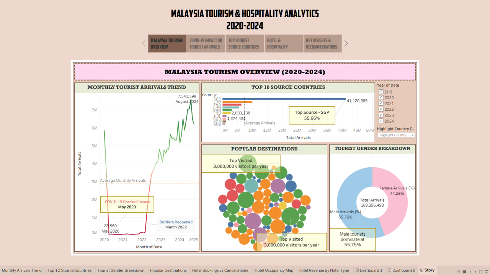

# Malaysia Tourism & Hospitality Analytics

A Tableau data visualization project analysing Malaysia's tourism and hospitality performance from 2020 to 2024.

# Project Overview

This project explores tourism and hospitality trends in Malaysia using Tableau and Tableau Prep Builder. The analysis focuses on tourist arrivals, source countries, popular destinations, hotel occupancy, bookings, cancellations and hotel revenue.

The objective was to perform exploratory data analysis and develop interactive dashboards that present meaningful tourism and hospitality insights.

## Datasets

The project uses four datasets:

1. **Malaysia Foreign Tourist Arrivals** - Real government data from data.gov.my
2. **Malaysia Hotel Occupancy** - Synthetic dataset created for academic analysis
3. **Popular Tourist Destinations in Malaysia** - Synthetic dataset
4. **Malaysia State Information** - Synthetic reference dataset

The main tourist arrivals dataset originally contained **13,050 records** covering January 2020 to October 2024. After data cleaning and preparation, **9,473 records** were used for analysis.

## Data Preparation

Data preparation was performed using **Tableau Prep Builder**.

- Renaming fields for consistency and clarity
- Correcting data types
- Filtering invalid or zero-value records
- Removing unidentified `XXX` country codes
- Preparing cleaned datasets for visualization
- Integrating datasets in Tableau Desktop using joins and relationships

## Dashboard

The project contains interactive Tableau dashboards covering:

- Monthly tourist arrival trends
- Top tourist source countries
- Gender distribution of tourist arrivals
- Popular tourist destinations
- Hotel bookings and cancellations
- Hotel occupancy by state
- Hotel revenue by hotel type

### Dashboard Preview



**[View Interactive Dashboard on Tableau Public](https://public.tableau.com/views/SW01083597-MalaysiaTourismHospitalityDashboard2020-2024/Dashboard1?:language=en-US)**

## Insights

- Singapore was the largest source of tourist arrivals in the analysed dataset.
- Tourist arrivals experienced a significant decline during the COVID-19 pandemic, followed by a gradual recovery.
- Kuala Lumpur recorded the highest average hotel occupancy among the states analysed.
- Hotel bookings, cancellations and revenue showed different patterns across months and hotel types.
- The dashboards allow users to explore these patterns interactively using filters, parameters and dashboard actions.

## Tools & Technologies

- **Tableau Desktop**
- **Tableau Prep Builder**
- **Microsoft Excel**
- **Data.gov.my**
- Data Cleaning & Preparation
- Data Visualization
- Dashboard Development
- Calculated Fields & Parameters

## Repository Structure

```text
malaysia-tourism-hospitality-analytics/
│
├── dashboard/
│   └── SW01083597 Nur Azima - FINAL PROJECT.twbx
│
├── images/
│   └── tourism_dashboard.jpg
│
├── prep/
│   └── SW01083597 Nur Azima - Prep Flow.tflx
│
└── README.md
